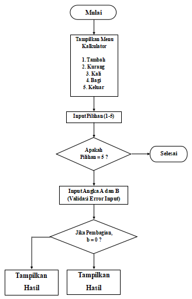

# TUGAS PROYEK KALKULATOR SEDERHANA

## Pendahuluan 
Proyek ini adalah suatu program untuk membuat aplikasi kalkulator sederhana berbasis konsol (command line interface) yang dibangun menggunakan bahasa pemrograman Python. Program ini berfungsi untuk membantu pengguna melakukan operasi aritmatika yang sederhana dan menyenangkan. Selain fungsi utamanya sebagai alat hitung, proyek ini dikembangkan sebagai simulasi tugas kolaborasi tim. Tujuan dari proyek ini yakni melatih kerja sama tim dalam penggunaan Git dan GitHub, yang mencakup manajemen branch, commit, pull request, serta penyelesaian konflik antaranggota tim.

## Fitur Utama

Aplikasi ini memiliki beberapa fitur utama untuk memudahkan pengguna dalam menggunakannya:

### 1. Operasi aritmatika, yang terdiri dari:
-  Penjumlahan

-  Pengurangan

-  Perkalian

-  Pembagian

### 2. Validasi input (error handling system)
Program ini dirancang sedemikian rupa untuk mencegah pengguna melakukan kesalahan dalam memasukkan input ke dalam aplikasi.

### 3. Looping di aplikasi
Pengguna dapat menggunakan aplikasi ini berulang kali tanpa harus menjalankan ulang program.

## Panduan Instalasi

1. Pastikan ***Python*** atau ***Visual Studio Code*** telah terinstall di laptop/komputer anda.
2. Buka link repository yang telah dilampirkan di laporan halaman pertama, maka anda akan diarahkan ke repository kami yang berisi proyek kalkulator sederhana dengan menggunakan bahasa pemrograman Phyton. Di branch default, download file bernama ***“main.py”***.
3. Tunggu sampai file ***"main.py*** terinstall dan siap untuk dijalankan.

## Panduan Menjalankan

1. Jika file telah terinstall, pindahkan file ***“main.py”*** ke folder user sesuai dengan alamat komputer/laptop masing-masing.
2. Ketik ***“python main.py”***, lalu jalankan.
3. Fungsi kalkulator sederhana dapat digunakan sesuai dengan kebutuhan pengguna. 
- Atau anda juga dapat membuka file ***“main.py”*** tersebut pada aplikasi Visual Studio Code agar dapat dijalankan lebih mudah. 

## Dokumentasi Teknis
### 1. Diagram Flowchart

### 2. Penjelasan
**A. Mulai(Start)** : Flowchart diawali dengan bertuliskan simbol oval "MULAI". Ini menandakan bahwa program kalkulator siap dijalankan.

**B. Menampilkan Menu Kalkulator** : Setelah mulai, sistem menampilkan menu

1. Tambah
2. Kurang
3. Kali
4. Bagi
5. Keluar

**C. Input Pilihan Pengguna** : Disini pengguna diminta untuk memilih operasi (1-5). Langkah ini digambarkan pada simbol persegi panjang yag dimana menyatakan proses yang akan dilakukan.

**D. Percabangan (Apakah pilihan = 5?)** : Disini terjadi pengambilan keputusan yang ditampilkan dengan simbol belah ketupat.
- Jika Ya(True) artinya pengguna memilih keluar (Program akan berhenti/selesai).
- Jika Tidak(False) artinya pengguna memilih operasi 1-4 dan melanjutkan ke input angka.

**E. Input angka A dan B** : Bagian ini program meminta pengguna untuk memasukkan angka untuk dioperasikan.

**F. Percabangan (Jika pembagian, b = 0?)** : Tahap ini adalah pengecekan khusus pada operasi pembagian. Ketika suatu bilangan dibagi dengan 0, maka muncul ***pesan error*** alias tidak terdefinisi. Sedangkan jika bilangan dibagi dengan bilangan yang bukan 0, sistem akan tetap melakukan perhitungan seperti biasa.

**G. Tampilkan Hasil** : Setelah operasi perhitungan sudah selesai dan berjalan dengan baik, sistem akan menampilkan hasil bagi pengguna. Hasil yang didapatkan menyesuaikan dengan operasi yang telah di pilih.

**H. Kembali ke menu** : Setelah hasil ditampilkan, alur kembali lagi ke menu utama. Hal ini memungkinkan pengguna melakukan perhitungan kembali tanpa harus menjalankan ulang program.

**I. Selesai(End)** : Program akan berakhir sampai pengguna memilih menu keluar(5) yang mengarahkan langsung ke simbol selesai. Ini menandakan bahwa program sudah selesai secara keseluruhan.

## Daftar Kontributor(TABEL)

| Nama | Nim | Link Akun GitHub |
| :---: | :---: | :---: |
| Gerald Imanuel Manongga | 250211060004 | https://github.com/manonggagerald-blip |
| Christoford Novert Gumerung | 250211060020 | https://github.com/crstofrd |
| Marvel Edmund Kumaat | 250211060066 | https://github.com/Hera28 |
